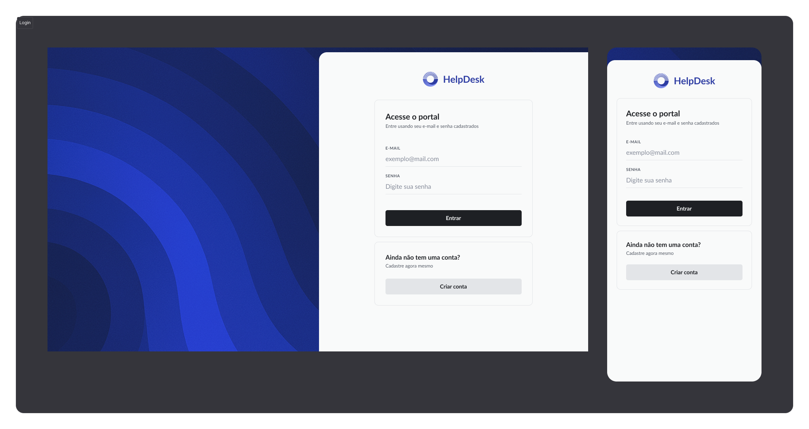
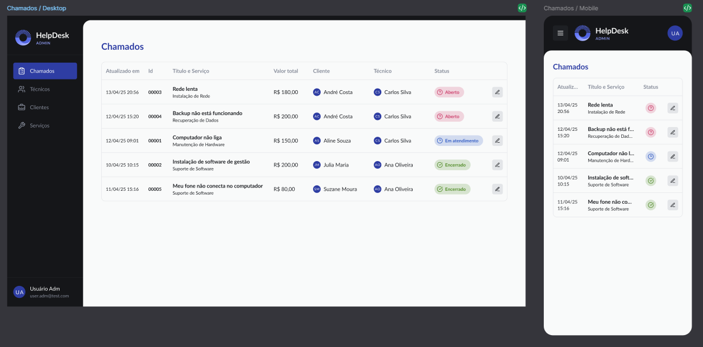

# HelpDesk WEB 💻

<p align="left">

</p>

Interface web desenvolvida em **React**, **TypeScript** e **Vite**, conectada à [HelpDesk API](https://github.com/rosendo2015/HelpDesk-API).  
O sistema oferece uma experiência moderna e intuitiva para gerenciamento de chamados, usuários e disponibilidade de técnicos.


---

## ⚙️ Funcionalidades

- Login e autenticação de usuários
- Cadastro e gerenciamento de chamados
- Painel administrativo para controle de técnicos e clientes
- Upload de avatar e perfil de usuário
- Comunicação direta com a **HelpDesk API**
- Interface **responsiva** e otimizada para desktop e mobile
- Organização modular com **contexts**, **hooks** e **services**

---

## 🧩 Arquitetura do Projeto

```plaintext
src/
 ├── assets/              # Imagens, ícones e estilos globais
 ├── components/          # Componentes reutilizáveis
 ├── contexts/            # Contextos globais (auth, theme, etc.)
 ├── hooks/               # Hooks personalizados
 ├── layout/              # Layouts principais da aplicação
 ├── Pages/               # Páginas principais
 │    ├── admin/          # Painel administrativo
 │    ├── cliente/        # Área do cliente
 │    ├── tecnico/        # Área do técnico
 │    ├── App.tsx         # Componente raiz
 │    ├── PageComponents.tsx
 │    ├── SignIn.tsx      # Tela de login
 │    └── SignUp.tsx      # Tela de cadastro
 ├── routes/              # Definição das rotas
 ├── services/            # Comunicação com a API (axios)
 ├── tests/               # Testes unitários e de integração
 ├── types/               # Tipagens globais
 ├── utils/               # Funções auxiliares
 ├── index.css            # Estilos globais
 ├── main.tsx             # Ponto de entrada da aplicação
 └── vite-env.d.ts        # Tipos do ambiente Vite

```

## 🚀 Como Executar

### \* Clone o repositório

git clone https://github.com/rosendo2015/HelpDesk-WEB.git

### \* Acesse a pasta

cd HelpDesk-WEB

### \* Instale as dependências

```
npm install
```

### \* Configure o ambiente

cp .env.example .env

### \* Defina a URL da API no arquivo .env

VITE_API_URL=http://localhost:3000

### \* Execute o projeto

npm run dev

## 🧰 Tecnologias Utilizadas

- React

- TypeScript

- Vite

- TailwindCSS

- Axios

- React Router DOM

- Context API

- Vitest + Jest para testes

- ESLint + Prettier para padronização de código

## 🧪 Testes

npm run test

## 🧱 Ferramentas e Configurações

- TailwindCSS para estilização rápida e responsiva

- Vite para build e desenvolvimento ultrarrápido

- Vitest para testes unitários

- Docker Compose (opcional) para ambiente containerizado

- CI/CD via GitHub Actions (opcional)

## 📸 Preview do Sistema

<p align="left">

</p>
<p align="left">

</p>

## 🤝 Contribuição

### Contribuições são bem-vindas!

- Faça um fork do projeto

- Crie uma branch (git checkout -b feature/nova-feature)

- Commit suas alterações (git commit -m 'Adiciona nova feature')

- Push para a branch (git push origin feature/nova-feature)

- Abra um Pull Request

## 📄 Licença

Este projeto está sob a licença MIT.
Sinta-se livre para usar, modificar e distribuir.

## 💬 Contato

Desenvolvido por Francisco Rosendo  
📧 rosendo2015@gmail.com
🔗 LinkedIn (linkedin.com in Bing)
